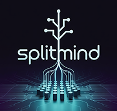

<p align="center">
  
</p>

<h1 align="center">SplitMind v2.0</h1>
<p align="center"><i>🧠 Enterprise-Grade Multi-Agent AI Development Platform</i></p>

<p align="center">
  
  
  
  
</p>

---

## 🚀 **What's New in SplitMind v2.0**

### 🏗️ **Complete Platform Redesign**
- **🎛️ Professional Web Dashboard** - Modern React/TypeScript interface
- **🛡️ Enterprise Security** - Safe project management with confirmation workflows
- **⚡ Real-time Everything** - Live WebSocket updates across all features
- **🗂️ Project Manager** - Complete project lifecycle management
- **⚙️ Global Settings** - Centralized configuration and API management

### 🤖 **Advanced Agent Coordination (A2AMCP)**
- **🔗 Multi-Agent Protocol** - Agents coordinate through Redis backend
- **📊 Live Coordination Dashboard** - Real-time agent monitoring with interactive graphs
- **🔒 File Locking System** - Prevents conflicts during parallel development
- **💬 Agent Communication** - Direct agent-to-agent messaging and interface sharing
- **📈 Comprehensive Analytics** - Todo tracking, heartbeat monitoring, completion metrics

### 🎯 **Smart Project Management**
- **📋 Project Manager Homepage** - Default landing page for power users
- **🗑️ Safe Deletion** - Type project name to confirm with complete cleanup options
- **🔄 Project Reset** - Clean slate functionality for testing and iteration
- **📊 Project Statistics** - Real-time insights and health monitoring
- **🚀 One-Click Launch** - Simplified project creation and setup

---

## ⚡ **Quick Start**

### 🎯 **One Command Setup**
```bash
git clone https://github.com/webdevtodayjason/splitmind.git
cd splitmind
python setup.py
```

### 🚀 **Launch Command Center**
```bash
python launch-dashboard.py
```

**Then open:** http://localhost:8000

---

## 🌟 **Core Features**

### 🎛️ **Command Center Dashboard**
- **📊 Real-time Project Overview** with live statistics
- **🤖 Agent Status Monitoring** with start times and duration tracking  
- **📈 Task Flow Visualization** with drag-and-drop kanban boards
- **⚙️ Orchestrator Control** with configurable agent limits and auto-merge
- **🔗 WebSocket Live Updates** for instant status synchronization

### 🧠 **AI Task Master 2.0**
- **🌊 Wave-Based Task Generation** - Intelligent dependency management
- **🎯 Custom AI Prompts** - Tailored instructions for each task
- **📋 Structured Task Breakdown** - Professional development workflows
- **🔄 Adaptive Planning** - Dynamic task adjustment based on progress
- **📝 Plan Editing** - Manual refinement of AI-generated strategies

### 🔄 **Multi-Agent Coordination**
- **🤝 A2AMCP Protocol** - Advanced agent-to-agent communication
- **📡 Real-time Coordination** - Live monitoring of agent interactions
- **🔒 Conflict Prevention** - File locking and resource management
- **💬 Agent Messaging** - Direct communication between AI agents
- **🧩 Interface Sharing** - Type definitions and shared components

### 🛡️ **Enterprise Security & Management**
- **🔐 Safe Project Deletion** - Type confirmation with cleanup options
- **🔄 Project Reset** - Complete environment cleanup
- **⚙️ Global Configuration** - Centralized API key and settings management
- **📊 Audit Trails** - Complete activity logging and monitoring
- **🚨 Error Recovery** - Graceful handling of failures and conflicts

---

## 🎯 **Complete Workflow**

### 1️⃣ **First Time Setup**
```bash
# Quick installation
python setup.py

# Launch dashboard  
python launch-dashboard.py
```

### 2️⃣ **Configure Global Settings**
1. Click **⚙️ Settings** in top navigation
2. Add your **Anthropic API Key**
3. Configure **Orchestrator Settings**:
   - Max concurrent agents (1-20)
   - Auto-merge preferences
   - Spawn intervals

### 3️⃣ **Create Your First Project**
1. **Project Manager** opens as homepage for returning users
2. Click **"+ Create Project"** or use **"Manage Projects"** button
3. Configure project details:
   - **Name & Description**
   - **Git Repository Path**
   - **Agent Limits**

### 4️⃣ **Generate AI-Powered Development Plan**
1. Navigate to project **Settings Tab**
2. Add **Project Overview** and **Initial Prompt**
3. Click **"🚀 AI Task Master"** for comprehensive planning
4. Review generated **wave-based task breakdown**

### 5️⃣ **Launch Multi-Agent Development**
1. **Start Orchestrator** in project sidebar
2. Watch **real-time task progression**:
   - `UNCLAIMED` → `UP_NEXT` → `IN_PROGRESS` → `COMPLETED` → `MERGED`
3. Monitor agents in **Coordination Dashboard**:
   - Live agent visualization
   - File lock monitoring  
   - Communication tracking

### 6️⃣ **Monitor & Coordinate**
- **📊 Task Board**: Drag-and-drop task management
- **🤖 Agent Monitor**: Live status and performance metrics
- **🔗 Coordination Tab**: Real-time multi-agent coordination
- **📡 Event Stream**: Live coordination events and communications

---

## 🏗️ **Architecture Overview**

### 🎛️ **Dashboard Architecture**
```
┌─────────────────┐    ┌─────────────────┐    ┌─────────────────┐
│   React/TS      │    │   FastAPI       │    │     Redis       │
│   Frontend      │◄──►│   Backend       │◄──►│   Coordination  │
│                 │    │                 │    │     Store       │
└─────────────────┘    └─────────────────┘    └─────────────────┘
         │                       │                       │
         │              ┌─────────────────┐              │
         │              │   WebSocket     │              │
         └──────────────┤   Real-time     ├──────────────┘
                        │   Updates       │
                        └─────────────────┘
```

### 🤖 **Agent Coordination (A2AMCP)**
```
┌─────────────────┐    ┌─────────────────┐    ┌─────────────────┐
│   Agent 1       │    │   Coordination  │    │   Agent 2       │
│   (Claude CLI)  │◄──►│   Monitor       │◄──►│   (Claude CLI)  │
│                 │    │   (Redis)       │    │                 │
└─────────────────┘    └─────────────────┘    └─────────────────┘
         │                       │                       │
         │              ┌─────────────────┐              │
         │              │   File Locks    │              │
         └──────────────┤   & Messages    ├──────────────┘
                        │   & Interfaces  │
                        └─────────────────┘
```

### 🔄 **Development Flow**
```
Project Creation → AI Planning → Task Generation → Agent Spawning
       │                │            │                  │
       ▼                ▼            ▼                  ▼
┌─────────────┐ ┌─────────────┐ ┌─────────────┐ ┌─────────────┐
│   Settings  │ │   AI Task   │ │   Wave      │ │  Parallel   │
│ & Overview  │ │   Master    │ │   Based     │ │  Execution  │
└─────────────┘ └─────────────┘ │   Tasks     │ └─────────────┘
                                └─────────────┘        │
                                       │               ▼
                                       ▼        ┌─────────────┐
                                ┌─────────────┐ │  Real-time  │
                                │Coordination │ │ Monitoring  │
                                │   & Merge   │ │ & Control   │
                                └─────────────┘ └─────────────┘
```

---

## 🛠️ **Configuration**

### ⚙️ **Global Settings**
Access via **Settings icon** in top navigation:

#### 🧠 **Anthropic API**
- **API Key**: Secure storage with validation
- **Model Selection**: Claude 3 Opus, Sonnet, Haiku, 3.5 Sonnet
- **Direct link** to Anthropic Console

#### 👥 **Orchestrator Control**
- **Enable/Disable**: Master orchestrator switch
- **Max Agents**: 1-20 concurrent agents
- **Auto-merge**: Automatic vs manual review
- **Spawn Interval**: 10-600 second intervals
- **Merge Strategy**: merge, rebase, squash

### 📊 **Project Settings**
Individual project configuration:
- **Project Overview**: Detailed context for AI agents
- **Initial Prompt**: Development objectives
- **Max Agents**: Project-specific limits
- **Git Integration**: Branch management and worktree handling

---

## 📊 **Real-time Monitoring**

### 🎛️ **Coordination Command Center**
**Location**: Project → Coordination Tab

#### 🕸️ **Live Agent Graph**
- **Pulsing nodes** represent active agents
- **Color coding**: 🟢 Active, 🟡 Working, 🔴 Offline
- **Progress bars** show todo completion
- **File lock indicators** prevent conflicts
- **Communication lines** show agent interactions

#### 📡 **Event Stream**
Real-time feed of:
- Agent registrations and heartbeats
- Todo creation and completion
- File locking and unlocking
- Inter-agent communications
- Task completion notifications

#### 📊 **Live Statistics**
- **Active vs Total Agents**
- **Todo Completion Rates**
- **File Lock Counts**
- **Communication Graph Analysis**

### 🤖 **Agent Status Monitoring**
**Location**: Project → Agents Tab

- **Individual agent cards** with health status
- **Start times** and **duration tracking**
- **Live session monitoring**
- **iTerm integration** for direct agent access
- **Session management** and cleanup tools

---

## 🗂️ **Project Management**

### 🏠 **Project Manager Homepage**
**Default page for returning users** - accessible via **"Manage Projects"**

#### 📋 **Project Grid View**
- **Visual project cards** with status indicators
- **Creation dates** and **Git repository status**
- **Quick access buttons**: Edit, Reset, Delete
- **Project statistics** and health monitoring

#### ✏️ **Project Operations**
- **✏️ Edit**: Update name, description, settings
- **🔄 Reset**: Clean tasks, sessions, branches
- **🗑️ Delete**: Safe deletion with confirmation

### 🛡️ **Enhanced Delete Safety**
**Enterprise-grade protection**:

1. **⚠️ Hazardous confirmation dialog**
2. **Type project name** to enable deletion
3. **Complete cleanup toggle**:
   - **Safe**: Remove from SplitMind only
   - **Complete**: Remove tasks, worktrees, branches, sessions, .splitmind directory
4. **Real-time validation** with visual feedback
5. **Disabled delete button** until confirmed

---

## 🧱 **Technical Architecture**

### 📁 **Project Structure**
```
splitmind/                     # Main installation
├── 📄 README.md              # This documentation
├── 🚀 launch-dashboard.py    # One-click launcher
├── ⚙️ setup.py               # Installation script
├── 📊 dashboard/             # Web interface
│   ├── 🔧 backend/          # FastAPI server
│   │   ├── api.py          # REST endpoints
│   │   ├── orchestrator.py # Agent management
│   │   ├── coordination_monitor.py # A2AMCP monitoring
│   │   ├── models.py       # Data structures
│   │   └── websocket_manager.py # Real-time updates
│   └── 🎨 frontend/         # React dashboard
│       ├── components/     # UI components
│       ├── services/       # API clients
│       └── hooks/          # Custom React hooks
├── 🤖 A2AMCP/              # Agent coordination
│   ├── mcp-server-redis.py # Coordination server
│   └── sdk/                # Python SDK
└── 📊 projects/            # User projects
    └── your-project/       # Individual project
        ├── .splitmind/     # Project metadata
        ├── worktrees/      # Git worktrees
        └── .git/           # Git repository
```

### 🔌 **API Architecture**

#### 📡 **REST Endpoints**
```
🗂️ Projects:     /api/projects/*
📋 Tasks:        /api/projects/{id}/tasks/*
🤖 Agents:       /api/projects/{id}/agents/*
⚙️ Orchestrator: /api/orchestrator/*
🧠 Plan Gen:     /api/projects/{id}/generate-*
🔗 Coordination: /api/projects/{id}/coordination/*
```

#### 🔄 **WebSocket Events**
```
📊 Real-time Updates:     /ws/updates
🔗 Coordination Stream:   /api/projects/{id}/coordination/live
```

#### 🤝 **A2AMCP Protocol**
```
Redis Store:
├── 🤖 splitmind:{project}:agents      # Agent registry
├── 💓 splitmind:{project}:heartbeat   # Agent health
├── 📝 splitmind:{project}:todos       # Task tracking
├── 🔒 splitmind:{project}:file_locks  # Resource locks
├── 🧩 splitmind:{project}:interfaces  # Shared types
└── 💬 splitmind:{project}:messages    # Communications
```

---

## 🚨 **Troubleshooting**

### 🔧 **Common Issues**

#### 🚫 **Can't Delete Projects**
**Symptom**: Delete button stays disabled
**Solution**: Type the exact project name in confirmation field

#### 🔄 **Tasks Stuck in UP_NEXT**
**Symptoms**: Tasks not being picked up by agents
**Solutions**:
1. Check **Orchestrator Status** (should be green/running)
2. Verify **Agent Limits** vs currently running agents
3. Review **File Conflicts** in coordination tab
4. Check **Claude CLI** configuration

#### 🌐 **WebSocket Disconnections**
**Symptoms**: No real-time updates, status indicators red
**Solutions**:
1. **Refresh browser** - auto-reconnects every 3 seconds
2. **Clear browser cache** and reload
3. **Check backend** is running on port 8000
4. **Restart dashboard**: `python launch-dashboard.py`

#### 🔄 **Agent Coordination Issues**
**Symptoms**: Agents not appearing in coordination tab
**Solutions**:
1. **Verify Redis** connection (Docker container running)
2. **Check MCP server** on port 5050
3. **Restart A2AMCP**: `cd A2AMCP && docker-compose restart`
4. **Check agent logs** for MCP registration errors

### 🧹 **Clean Reset**
**Complete system reset**:
```bash
# 1. Stop all processes
tmux kill-server
docker-compose -f A2AMCP/docker-compose.yml down

# 2. Clear configuration
rm -f config.json projects.json

# 3. Reset Redis data
docker-compose -f A2AMCP/docker-compose.yml down -v

# 4. Rebuild frontend
cd dashboard/frontend
rm -rf node_modules dist
npm install
npm run build
cd ../..

# 5. Restart everything
docker-compose -f A2AMCP/docker-compose.yml up -d
python launch-dashboard.py
```

### 🔍 **Debug Mode**
**Verbose logging**:
```bash
python launch-dashboard.py --dev
```

---

## 🎯 **Advanced Usage**

### 🔧 **Custom Task Prompts**
**Enhanced AI Instructions**:
1. Click any task card to open details
2. Edit the **AI Prompt** field with specific requirements
3. Add **technical specifications** and **context**
4. Include **dependency information** and **constraints**

### 📊 **Coordination Monitoring**
**Real-time Agent Analysis**:
1. Navigate to **Coordination Tab** in any project
2. **🕸️ Live Graph**: Interactive agent visualization
3. **📡 Event Stream**: Real-time coordination events
4. **🔒 File Locks**: Active resource conflicts
5. **📈 Statistics**: Performance metrics and health

### 🏗️ **Multi-Project Workflows**
**Enterprise Project Management**:
1. **Project Manager Homepage**: Overview of all projects
2. **Quick switching**: Select projects from top navigation
3. **Bulk operations**: Reset or delete multiple projects
4. **Resource monitoring**: Cross-project agent usage

### ⚙️ **Orchestrator Optimization**
**Performance Tuning**:
- **Agent Limits**: Balance speed vs system resources
- **Spawn Intervals**: Adjust based on task complexity
- **Auto-merge Settings**: Enable for faster iteration
- **File Lock Monitoring**: Prevent coordination conflicts

---

## 🔮 **Roadmap**

### 🚀 **Version 2.1 (Coming Soon)**
- **🔗 GitHub Integration**: Direct PR management
- **📊 Analytics Dashboard**: Performance insights and metrics
- **🤖 Agent Templates**: Pre-configured agent behaviors
- **🔄 Workflow Automation**: Custom development pipelines

### 🌟 **Version 2.2 (Future)**
- **☁️ Cloud Deployment**: One-click cloud hosting
- **👥 Team Collaboration**: Multi-user project management
- **🔌 Plugin System**: Custom integrations and extensions
- **📱 Mobile Interface**: Project monitoring on mobile

### 🎯 **Version 3.0 (Vision)**
- **🧠 Multi-LLM Support**: OpenAI, Gemini, local models
- **🔄 Advanced Coordination**: Complex multi-agent workflows  
- **📊 Enterprise Features**: SSO, audit logs, compliance
- **🌐 Distributed Agents**: Cross-platform and remote execution

---

## 🤝 **Contributing**

### 🛠️ **Development Setup**
```bash
# 1. Fork and clone
git clone https://github.com/yourusername/splitmind.git
cd splitmind

# 2. Install dependencies
python setup.py

# 3. Start development server
python launch-dashboard.py --dev

# 4. Frontend development
cd dashboard/frontend
npm run dev  # Hot reload development
```

### 📋 **Contribution Guidelines**
1. **🔍 Check Issues**: Look for existing bugs or feature requests
2. **🌿 Create Branch**: `git checkout -b feature/amazing-feature`
3. **✅ Follow Standards**: Use existing code style and patterns
4. **🧪 Test Changes**: Verify all functionality works
5. **📝 Update Docs**: Add documentation for new features
6. **🔄 Submit PR**: Detailed description of changes

### 🏗️ **Architecture Contributions**
- **🎨 Frontend**: React/TypeScript components in `/dashboard/frontend`
- **🔧 Backend**: FastAPI endpoints in `/dashboard/backend`
- **🤖 Coordination**: A2AMCP protocol in `/A2AMCP`
- **📊 Monitoring**: Real-time features and WebSocket handling

---

## 📄 **License**

**MIT License** - see LICENSE file for details.

SplitMind is open source software built for the developer community.

---

## 🙏 **Acknowledgments**

### 🤖 **AI Partners**
- **Anthropic Claude** - Powering intelligent agent coordination
- **Claude Code** - Development acceleration platform

### 🛠️ **Technology Stack**
- **React + TypeScript** - Modern frontend development
- **FastAPI + Python** - High-performance backend
- **Redis** - Real-time coordination store
- **WebSockets** - Live dashboard updates
- **Docker** - Containerized coordination services

### 🌟 **Community**
- **Early Adopters** - Feedback and testing
- **Contributors** - Code, documentation, and ideas
- **Developer Community** - Inspiration and innovation

---

## 📞 **Support & Community**

### 🆘 **Get Help**
- **📧 Email**: jason@webdevtoday.com
- **🐛 Issues**: [GitHub Issues](https://github.com/webdevtodayjason/splitmind/issues)
- **📖 Documentation**: [Full Docs](https://github.com/webdevtodayjason/splitmind/docs)

### 🌐 **Connect**
- **🐙 GitHub**: [@webdevtodayjason](https://github.com/webdevtodayjason)
- **🐦 Twitter**: [@webdevtodayjason](https://twitter.com/webdevtodayjason)
- **💼 LinkedIn**: [Jason Brashear](https://linkedin.com/in/jasonbrashear)
- **🌐 Website**: [WebDevToday.com](https://webdevtoday.com)

### 🚀 **Enterprise**
For enterprise licensing, custom integrations, or professional support:
- **📧 Enterprise**: enterprise@webdevtoday.com
- **📞 Consulting**: Available for custom implementations

---

<p align="center">
  
</p>

<p align="center">
  <strong>🧠 SplitMind v2.0 - Where AI Agents Collaborate</strong><br>
  <em>Built with ❤️ by Jason Brashear</em>
</p>

---

## 🏷️ **Tags**
`ai-development` `multi-agent` `claude-ai` `task-orchestration` `real-time-coordination` `web-dashboard` `enterprise-tools` `parallel-development` `agent-coordination` `a2amcp` `redis` `websockets` `react` `typescript` `fastapi` `python`